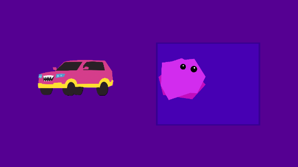

# Sample Unity Movement

A sample Unity (2020.1.2f1) project that shows

- Essential movement and physics concepts in Unity
- [C# inheritance](https://learn.unity.com/tutorial/inheritance) with base and child classes
- Basic use of the URP (Universal Render Pipeline)

## HelloDavidson

A Hello World! for basic physics in game engines. Just press play!

- What happens when you move the RigidBody from a letter to its individual cubes?
- What happens when you enable the Fish GameObject while the game is running?

## Movement_Basic

Demonstrates common methods ([transform](https://github.com/omundy/dig250-game-art-dev/blob/master/reference-sheets/Unity-Vectors) vs. [physics](https://github.com/omundy/dig250-game-art-dev/blob/master/reference-sheets/Unity-Physics.md)) to move GameObjects. In the Hierarchy you will see...

### Movement via tween

- **SphereTween** - "bounce" movement using `Mathf.Lerp` on `transform.position`
- **CubesTranslate** - uses `transform.Translate()` to "teleport" GameObject position.
	1. Input - Parameters received from keyboard input
	1. Floating - Params from `Mathf.Sin` and `Mathf.Cos`
	1. Noise – Params from `Mathf.PerlinNoise()`

Note: Affecting transform directly is fine for simple movement but remember that physics interactions (collisions, etc.) will not work as expected.

### Movement moved via Physics

- **CubesMovePosition** - uses `Rigidbody.MovePosition()` to manipulate `transform.position` inside `FixedUpdate()`, but calculates collision (mostly) along the way.
	1. Input, Floating, and Noise examples - same as above but with `MovePosition`
	1. All the wander examples use a wandering algorithm
- **CubesAddforce** - Uses `AddForce()` so physics and collision are computed.
	1. Input, Floating, Noise, and Wander examples - same as above except with `AddForce()` which affects velocity and feels much more like floating in space
- **MovePositionWanderComplex** and **AddForceWanderComplex** contain duplicates of the above in order to measure performance.

## Movement_Constrain

- **Constrain GameObject to an area** - Click and drag Tally to see constraints (using [`Bounds`](https://docs.unity3d.com/ScriptReference/Bounds.html)) or move the product monster (with arrow keys).

## Movement_Rotation

- **Rotation Examples** - Use arrow keys to move the center object

## Resources

More info on movement and physics in Unity

- Class References
	- [Unity Movement Vectors](https://github.com/omundy/dig250-game-art-dev/blob/master/reference-sheets/Unity-Movement-Vectors)
	- [Unity Movement Physics](https://github.com/omundy/dig250-game-art-dev/blob/master/reference-sheets/Unity-Movement-Physics.md)
Tutorials
	- [Move in Unity3D - Ultimate Unity Tutorial](https://www.youtube.com/watch?v=fyV77lN1Yl0&ab_channel=JasonWeimann) (49:23)
	- [Unity Movement [RigidBody vs Translate]](https://www.youtube.com/watch?v=ixM2W2tPn6c&ab_channel=PressStart) (10:30)
	- [How to add Force correctly | Unity Physics 101 (1/3)](https://www.youtube.com/watch?v=BNiAt0HnC5M) (10:30)

## URP (Universal Render Pipeline)

You can create a URP project using an option inside Unity Hub. When [converting from legacy rendering](https://docs.unity3d.com/Packages/com.unity.render-pipelines.universal@7.1/manual/InstallURPIntoAProject.html) to URP:

- Install URP Package
- Create URP asset and add to graphics settings
- Camera - Check rendering settings
- Scene - Use Lighting Settings
- Ensure all your materials use [URP shaders](https://docs.unity3d.com/Packages/com.unity.render-pipelines.universal@7.1/manual/upgrading-your-shaders.html)
